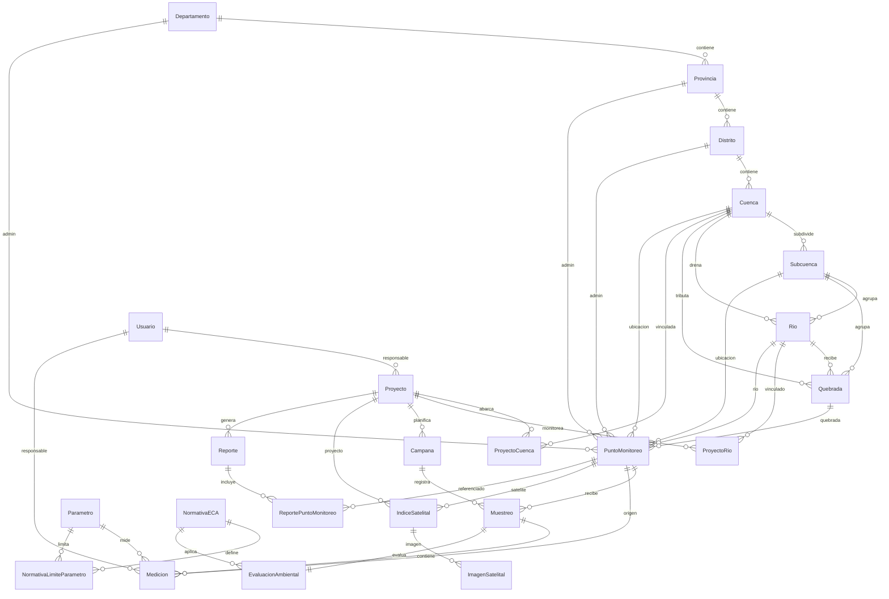

# HydroVision — Modelo de Datos Ambiental v2 (Fase 5.1)

**Versión:** 5.1.0  
**Motor:** PostgreSQL 16 · Prisma ORM  
**Normalización:** 3FN · Multi-proyecto · Preparado GEE · Preparado IA

---

## 1. Resumen ejecutivo

El modelo v2 redefine HydroVision como plataforma profesional de monitoreo ambiental hídrico. Separa la hidrología en **Cuenca → Subcuenca → Río / Quebrada → Punto de Monitoreo**, normaliza **Parámetro + Medición + Normativa ECA**, y prepara campos para **Google Earth Engine** e **Inteligencia Artificial** sin modificar la interfaz existente.

La UI continúa consumiendo `HydroVisionDataStore` vía `getDataStore()`. El mapper traduce `PuntoMonitoreo` → `Estacion` para compatibilidad.

---

## 2. Diagrama Entidad-Relación



---

## 3. Catálogo de tablas

### 3.1 Geografía administrativa

| Tabla | Entidad | Descripción |
|-------|---------|-------------|
| `departamentos` | Departamento | División política nivel 1 (Perú) |
| `provincias` | Provincia | Subdivisión departamental |
| `distritos` | Distrito | Subdivisión provincial |

**Campos comunes:** `id`, `estado`, `observaciones`, `created_at`, `updated_at`

---

### 3.2 Hidrología

| Tabla | Entidad | Descripción |
|-------|---------|-------------|
| `cuencas` | Cuenca | Unidad hidrográfica principal |
| `subcuencas` | **Subcuenca** | Subdivisión de cuenca (nueva v2) |
| `rios` | Río | Cuerpo de agua principal |
| `quebradas` | **Quebrada** | Afluente / curso menor (nueva v2) |

**Relaciones:**
- `Cuenca 1—N Subcuenca 1—N Rio`
- `Cuenca 1—N Quebrada` (opcionalmente vinculada a Río)
- `Rio N—1 Subcuenca` (opcional)

---

### 3.3 Proyecto (multi-proyecto)

| Tabla | Entidad | Descripción |
|-------|---------|-------------|
| `proyectos` | Proyecto | Programa de monitoreo ambiental |
| `proyecto_cuencas` | ProyectoCuenca | N:M Proyecto ↔ Cuenca |
| `proyecto_rios` | **ProyectoRio** | N:M Proyecto ↔ Río (nueva v2) |

Permite gestionar simultáneamente proyectos de tesis, consultoría y monitoreo institucional.

---

### 3.4 Punto de Monitoreo

| Tabla | Entidad Prisma | Tabla física |
|-------|----------------|--------------|
| `PuntoMonitoreo` | Punto de Monitoreo | `estaciones` |

**Campos específicos v2:**

| Campo | Tipo | Descripción |
|-------|------|-------------|
| `codigo` | VARCHAR(10) | P1, P2, … |
| `nombre` | VARCHAR(200) | Nombre descriptivo |
| `latitude` / `longitude` | FLOAT | WGS84 |
| `altitud` | FLOAT | m.s.n.m. |
| `departamento_id` | FK | Ubicación administrativa |
| `provincia_id` | FK | Ubicación administrativa |
| `distrito_id` | FK | Ubicación administrativa |
| `tipo_cuerpo_agua` | ENUM | river, stream, canal, reservoir, lagoon |
| `fotografia_url` | VARCHAR(500)? | Preparado almacenamiento S3/Cloud |
| `estado` | ENUM | active, maintenance, offline |
| `estado_registro` | ENUM | active, inactive, archived |
| `observaciones` | TEXT? | Notas de campo |

---

### 3.5 Campaña y Muestreo

| Tabla | Entidad | Estado |
|-------|---------|--------|
| `campanas` | Campaña | `EstadoCampana` |
| `muestreos` | Muestreo | `EstadoMuestreo`: registered, validated, rejected |

---

### 3.6 Parámetro · Medición · Normativa ECA

| Tabla | Entidad | Descripción |
|-------|---------|-------------|
| `parametros` | Parámetro | Catálogo fisicoquímico |
| `mediciones` | Medición | Valor individual normalizado |
| `normativas_eca` | **NormativaECA** | Marco legal ECA (nueva v2) |
| `normativa_limites_parametro` | **NormativaLimiteParametro** | Límites por parámetro (nueva v2) |

**Medición — campos v2:**

| Campo | Descripción |
|-------|-------------|
| `valor` | Resultado analítico |
| `unidad` | mg/L, NTU, UPH, … |
| `fecha_medicion` | Timestamp de medición |
| `metodo_analisis` | SM 2550 B, APHA 4500, … |
| `laboratorio` | Entidad analítica |
| `responsable_id` | FK Usuario |
| `observaciones` | Notas QA/QC |
| `calidad_dato` | valid, estimated, suspect |

**Justificación 3FN:** Los límites ECA se extrajeron de `parametros` hacia `normativa_limites_parametro`, eliminando dependencia del catálogo respecto a la normativa vigente.

---

### 3.7 Evaluación Ambiental

| Tabla | `evaluaciones_ambientales` |
|-------|---------------------------|

| Campo IA | Uso futuro |
|----------|------------|
| `score_riesgo` | Puntuación ML 0–100 |
| `nivel_alerta` | low, medium, high, critical |
| `model_version` | Trazabilidad del modelo |
| `normativa_id` | FK NormativaECA |

---

### 3.8 Satélite (preparado GEE)

| Tabla | Entidad |
|-------|---------|
| `indices_satelitales` | IndiceSatelital |
| `imagenes_satelitales` | **ImagenSatelital** (nueva v2) |

**Índices almacenados:**

| Índice | Campo |
|--------|-------|
| NDWI | `ndwi` |
| NDVI | `ndvi` |
| MNDWI | `mndwi` |
| NDTI | `ndti` |
| Temperatura superficial | `temperatura_superficial` |
| Cobertura vegetal | `cobertura_vegetal` |
| Cobertura nubosa | `cobertura_nubosa` |

**ImagenSatelital** almacena URL Sentinel-2, tile ID, bandas espectrales (JSON) y metadata GEE.

---

### 3.9 Usuario y Reporte

| Tabla | Campos v2 adicionales |
|-------|----------------------|
| `usuarios` | `estado`, `observaciones` |
| `reportes` | `proyecto_id`, `observaciones` |
| `reporte_estaciones` | N:M Reporte ↔ PuntoMonitoreo |

---

## 4. Relaciones clave

```
Proyecto ──< Campana ──< Muestreo ──< Medicion >── Parametro
                              │
                              └── EvaluacionAmbiental >── NormativaECA
PuntoMonitoreo ──< IndiceSatelital ──< ImagenSatelital
Cuenca ──< Subcuenca ──< Rio ──< PuntoMonitoreo
Cuenca ──< Quebrada ──< PuntoMonitoreo (alternativo)
```

---

## 5. Justificación técnica

| Decisión | Justificación |
|----------|---------------|
| **Subcuenca + Quebrada** | Modelado hidrológico real para cuencas peruanas con afluentes |
| **PuntoMonitoreo con geo admin** | Consultas espaciales sin joins múltiples en dashboard |
| **NormativaECA separada** | Cambio de normativa sin alterar catálogo de parámetros |
| **Medición normalizada** | Trazabilidad analítica (laboratorio, método, responsable) |
| **ImagenSatelital** | Separar índices numéricos de assets raster Sentinel-2 |
| **ProyectoRio** | Multi-proyecto sobre múltiples cuencas/ríos |
| **@@map("estaciones")** | Compatibilidad migración v5.0 → v5.1 sin romper UI |

---

## 6. Preparación Google Earth Engine

1. `IndiceSatelital` recibe índices calculados via GEE API
2. `ImagenSatelital.url` almacena asset exportado (Cloud Storage)
3. `tile_id`, `bandas`, `metadata` conservan trazabilidad GEE
4. `FutureEarthEngineProvider` insertará en estas tablas (Fase 6+)

---

## 7. Preparación Inteligencia Artificial

1. `EvaluacionAmbiental.score_riesgo` — output del modelo ML
2. `EvaluacionAmbiental.nivel_alerta` — clasificación automática
3. `EvaluacionAmbiental.model_version` — versionado del modelo
4. `Medicion.calidad_dato` — filtrado de datos para entrenamiento
5. Histórico normalizado en `mediciones` facilita series temporales para ML

---

## 8. Compatibilidad con la aplicación

| Capa UI | Capa DB v2 |
|---------|------------|
| `Estacion` | `PuntoMonitoreo` |
| `Muestra` | `Muestreo` |
| `ParametrosFisicoquimicos` | `Medicion[]` agregadas |
| `ClasificacionECA` | `EvaluacionAmbiental` |
| `IndicesSatelitales` | `IndiceSatelital` |

Mapper: `src/database/mappers/hydrovision-store.mapper.ts`

---

## 9. Migraciones

| Migración | Descripción |
|-----------|-------------|
| `20250801180000_fase_5_0_init` | Esquema base |
| `20250801210000_fase_5_1_model_v2` | Modelo ambiental profesional v2 |

```powershell
npm run db:generate
npm run db:migrate
npm run db:seed
```

---

## 10. Enumeraciones

| Enum | Valores |
|------|---------|
| `EstadoRegistro` | active, inactive, archived |
| `EstadoPuntoMonitoreo` | active, maintenance, offline |
| `EstadoMuestreo` | registered, validated, rejected |
| `EstadoNormativa` | draft, active, revoked |
| `TipoCuerpoAgua` | river, stream, canal, reservoir, lagoon |
| `EstadoECA` | compliant, alert, non_compliant |
| `NivelAlerta` | low, medium, high, critical |

---

## 11. Índices y restricciones

- FK con `ON DELETE RESTRICT` en entidades maestras
- FK con `ON DELETE CASCADE` en mediciones e imágenes satelitales
- `UNIQUE(cuenca_id, codigo)` en PuntoMonitoreo y Río
- `UNIQUE(muestreo_id, parametro_id)` en Medicion
- Índices compuestos en `(punto_monitoreo_id, fecha_adquisicion)` para consultas temporales

---

## 12. Archivos relacionados

```
prisma/schema.prisma
prisma/migrations/20250801210000_fase_5_1_model_v2/
prisma/seed.ts
src/database/mappers/hydrovision-store.mapper.ts
src/database/constants/parametros-catalog.ts
docs/FASE5_0.md
```
