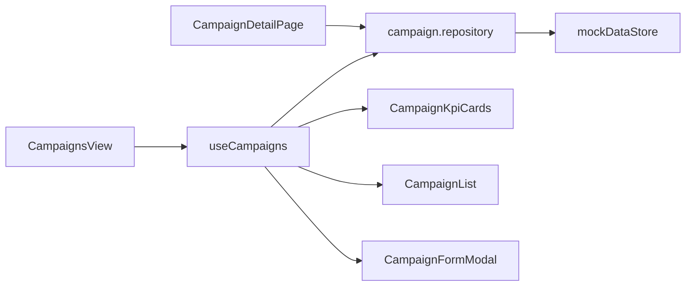

# Fase 3.2 — Sistema de Gestión de Campañas de Monitoreo

**Proyecto:** HydroVision  
**Fecha:** Julio 2026  
**Estado:** Módulo UI completo · Datos simulados en memoria · PostgreSQL **no conectado**

---

## 1. Objetivo

Implementar un módulo profesional para administrar campañas de monitoreo ambiental, manteniendo el estilo visual existente y operando sobre datos mock mutables en memoria.

---

## 2. Arquitectura

### 2.1 Capas

```
src/app/campanas/              → Rutas Next.js
src/components/campaigns/      → UI del módulo
src/hooks/                     → useCampaigns, useCampaignFilters, usePagination
src/lib/repositories/          → campaign.repository.ts (CRUD mock)
src/types/campaign.ts          → DTOs de UI
src/data/mock/store.ts         → Fuente de verdad (mutable en cliente)
```

### 2.2 Flujo de datos



1. **Server:** `page.tsx` carga datos iniciales del mock store.
2. **Client:** `useCampaigns` mantiene estado reactivo (listado, KPIs, filtros).
3. **Create:** `createCampana()` muta `mockDataStore.campanas` y refresca estado local.
4. **Detail:** Página cliente lee del mismo store del navegador (coherencia post-creación).

### 2.3 Principios

| Principio | Aplicación |
|-----------|------------|
| **SRP** | Repositorio separado de UI y hooks |
| **DRY** | `FilterSelect`, `Card`, `Pagination`, `Modal` reutilizados |
| **OCP** | Repository intercambiable por Prisma en fase futura |
| **Clean Architecture** | Dominio en `models/`, DTOs en `types/`, infra en `repositories/` |

---

## 3. Componentes

| Componente | Responsabilidad |
|------------|-----------------|
| `CampaignsView` | Vista principal: KPIs, filtros, listado, paginación, modal |
| `CampaignKpiCards` | Contadores: total, en curso, planificadas, finalizadas |
| `CampaignFiltersBar` | Buscador + filtros (fecha, responsable, cuenca, estado) |
| `CampaignList` | Tarjetas de campaña con código, fechas, estaciones, muestras |
| `CampaignFormModal` | Formulario "Nueva Campaña" con validación |
| `CampaignDetailView` | Vista detalle: info general + estaciones asociadas |
| `CampaignStatusBadge` | Badge de estado con colores semánticos |

### UI reutilizable creada

| Componente | Ubicación |
|------------|-----------|
| `Modal` | `src/components/ui/Modal.tsx` |
| `SearchInput` | `src/components/ui/SearchInput.tsx` |
| `Pagination` | `src/components/ui/Pagination.tsx` |
| `FormField` | `src/components/ui/FormField.tsx` |

### Hooks

| Hook | Función |
|------|---------|
| `useCampaigns` | Estado, filtros, paginación, creación |
| `useCampaignFilters` | Estado de filtros con reset |
| `usePagination` | Paginación genérica reutilizable |

---

## 4. Funcionalidades

### Listado

Cada campaña muestra:

- Código (`CAMP-2025-01`)
- Nombre
- Fecha de inicio
- Responsable
- Cuenca y río
- Número de estaciones (derivado del río)
- Número de muestras
- Estado (badge)

### Nueva campaña

Campos: nombre, responsable, fecha, cuenca, río, observaciones.

Al guardar:

- Se genera `id` y `codigo` automáticos
- Estado inicial: **Planificada**
- `fechaFin` = fecha inicio + 2 meses
- KPIs, listado y paginación se actualizan al instante

### Vista detalle (`/campanas/[id]`)

- Información general
- Estaciones asociadas al río
- Contadores de muestras y estaciones
- Estado de la campaña

### Búsqueda y filtros

- **Búsqueda:** código, nombre, responsable, río, cuenca
- **Filtros:** fecha (mes), responsable, cuenca, estado
- **Paginación:** 5 campañas por página

---

## 5. Mejoras respecto a Fase 3.1

1. **Modelo extendido:** campo `codigo` en `CampanaMonitoreo`
2. **Seed enriquecido:** 5 campañas demo (paginación y filtros)
3. **Repositorio dedicado:** `campaign.repository.ts` con CRUD mock
4. **Labels de estado:** `ESTADO_CAMPANA_LABELS` en enums
5. **Navegación:** enlace "Campañas" activo en sidebar
6. **Primer modal/formulario** del proyecto (patrón reutilizable)

---

## 6. Conexión futura con PostgreSQL

En **Fase 3.3** (activación BD):

```typescript
// campaign.repository.ts — patrón previsto
export async function getAllCampanaSummaries(): Promise<CampanaSummary[]> {
  if (isDatabaseConfigured()) {
    const db = getPrismaClient();
    const rows = await db.campana.findMany({ include: { ... } });
    return rows.map(toSummary);
  }
  return mockDataStore.campanas.map(toSummary);
}

export async function createCampana(input: CreateCampanaInput) {
  if (isDatabaseConfigured()) {
    return db.campana.create({ data: { ...input } });
  }
  // fallback mock actual
}
```

Pasos:

1. `npm install @prisma/client`
2. `npm run db:migrate` + `npm run db:seed`
3. Implementar `PrismaCampaignRepository`
4. `USE_DATABASE=true`
5. Convertir funciones del repositorio a `async` y actualizar hooks

El schema Prisma ya incluye `model Campana` con campo `codigo` alineado al dominio.

---

## 7. Rutas

| Ruta | Descripción |
|------|-------------|
| `/campanas` | Listado + gestión |
| `/campanas/[id]` | Detalle de campaña |

---

## 8. Verificación

```powershell
cd C:\Users\ferch\Projects\hydrovision
npm run dev
```

1. Abrir `http://localhost:3000/campanas`
2. Verificar KPIs, filtros y paginación
3. Crear una campaña con "Nueva Campaña"
4. Confirmar actualización de contadores y listado
5. Abrir detalle desde "Ver detalle"
6. Confirmar que `/` (Dashboard) sigue funcionando sin cambios

---

## 9. Referencias

- Fase anterior: `docs/FASE3_1.md`
- Modelo de dominio: `src/models/monitoring.ts`
- Mock store: `src/data/mock/store.ts`
- Schema Prisma: `prisma/schema.prisma`
