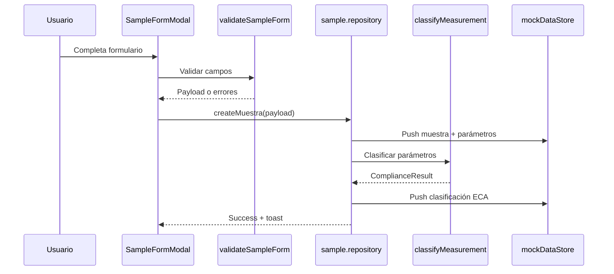

# Fase 3.3 — Registro Profesional de Muestreos Ambientales

**Proyecto:** HydroVision  
**Fecha:** Julio 2026  
**Estado:** Módulo completo · Mock Data · PostgreSQL **no conectado**

---

## 1. Objetivo

Crear un módulo profesional para registrar campañas de monitoreo y las muestras obtenidas en cada estación, con clasificación automática ECA y CRUD completo en memoria.

---

## 2. Arquitectura

### 2.1 Jerarquía de datos

```
Campaña de monitoreo
   └── Estación (P1, P2, …)
          └── Muestra(s)
                 ├── Parámetros fisicoquímicos (1:1)
                 └── Clasificación ECA (1:1, automática)
```

### 2.2 Capas

| Capa | Ubicación | Responsabilidad |
|------|-----------|-----------------|
| Rutas | `src/app/muestreos/` | Páginas Next.js |
| UI | `src/components/sampling/` | Vistas, tabla, formulario, detalle |
| Hooks | `src/hooks/useSamples.ts` | Estado reactivo, CRUD, paginación |
| Repositorio | `src/lib/repositories/sample.repository.ts` | CRUD mock |
| Utilidades | `src/lib/sampling/sampling-utils.ts` | Validación, fechas, clasificación ECA |
| Dominio | `src/models/monitoring.ts` | `Muestra`, `ParametrosFisicoquimicos` |
| Tipos UI | `src/types/sampling.ts` | DTOs del módulo |

### 2.3 Flujo de registro



---

## 3. Componentes

| Componente | Descripción |
|------------|-------------|
| `SamplingView` | Vista principal: selector de campaña, KPIs, tabla, paginación |
| `SampleKpiCards` | Total, cumple ECA, alerta, no cumple |
| `SampleTable` | Tabla con Ver / Editar / Eliminar |
| `SampleFormModal` | Formulario crear/editar con validación |
| `SampleDetailView` | Detalle con parámetros y clasificación ECA coloreada |

### UI reutilizable

| Componente | Uso |
|------------|-----|
| `SuccessToast` | Confirmación de registro exitoso |
| `ConfirmDialog` | Confirmación de eliminación |
| `Modal`, `FormField`, `Pagination` | Heredados de fases anteriores |

---

## 4. Formulario de muestra

### Campos generales

| Campo | Validación |
|-------|------------|
| Campaña | Obligatorio |
| Fecha | Obligatorio |
| Hora | Obligatorio |
| Estación | Obligatorio (filtrada por río de la campaña) |
| Responsable | Obligatorio |
| Clima | Obligatorio (select) |
| Color aparente | Obligatorio (select) |
| Observaciones | Obligatorio |

### Parámetros fisicoquímicos

| Parámetro | Unidad |
|-----------|--------|
| pH | — (0–14) |
| Temperatura | °C |
| Conductividad | µS/cm |
| Oxígeno disuelto | mg/L |
| Turbidez | NTU |
| Sólidos disueltos totales | mg/L |
| Caudal | m³/s |

Todos los valores son simulados y se validan como numéricos ≥ 0.

---

## 5. Clasificación ECA automática

Al registrar o editar una muestra:

1. Se crean/actualizan `ParametrosFisicoquimicos`
2. Se invoca `classifyMeasurement()` (`src/lib/eca/classifier.ts`)
3. Se persiste `ClasificacionECA` con estado:
   - **Cumple ECA** (verde)
   - **En alerta** (ámbar)
   - **No cumple** (rojo)

La vista detalle muestra parámetros violados y en alerta con tarjetas coloreadas.

---

## 6. Tabla de muestras

Columnas: Código, Fecha, Estación, Responsable, Estado ECA, Acciones.

Acciones:

- **Ver** → `/muestreos/[id]`
- **Editar** → Modal con datos precargados
- **Eliminar** → Diálogo de confirmación

---

## 7. Preparación para PostgreSQL

El repositorio mock sigue el patrón de Fase 3.2:

```typescript
// Futuro: sample.repository.ts
export async function createMuestra(payload: CreateMuestraPayload) {
  if (isDatabaseConfigured()) {
    return db.$transaction(async (tx) => {
      const muestra = await tx.muestra.create({ data: { ... } });
      await tx.parametrosFisicoquimicos.create({ data: { muestraId: muestra.id, ... } });
      await tx.clasificacionECA.create({ data: { ... } });
      return toSummary(muestra);
    });
  }
  // mock actual
}
```

Entidades Prisma ya definidas: `Muestra`, `ParametrosFisicoquimicos`, `ClasificacionECA`.

Campos nuevos del dominio (`clima`, `colorAparente`) se agregarán al schema en la migración de activación.

---

## 8. Preparación para Inteligencia Artificial (Fase 6)

Los datos registrados alimentarán futuros modelos de riesgo:

| Dato | Uso IA futuro |
|------|---------------|
| Parámetros fisicoquímicos | Features de entrenamiento |
| Clasificación ECA | Etiqueta supervisada |
| Clima + estación + campaña | Contexto espacial-temporal |
| Series temporales por estación | Detección de anomalías |

El módulo expone DTOs tipados (`MuestraDetail`) listos para exportar a CSV/Parquet o API REST.

---

## 9. Rutas

| Ruta | Descripción |
|------|-------------|
| `/muestreos` | Listado y registro |
| `/muestreos/[id]` | Detalle con clasificación ECA |

---

## 10. Verificación

```powershell
cd C:\Users\ferch\Projects\hydrovision
npm run dev
```

1. Sidebar → **Registro de Muestreos**
2. Filtrar por campaña
3. **Registrar Muestra** → completar todos los campos
4. Ver toast de confirmación y KPIs actualizados
5. Probar Ver / Editar / Eliminar
6. Confirmar Dashboard y Campañas sin cambios

---

## 11. Referencias

- Fase anterior: `docs/FASE3_2.md`
- Clasificador ECA: `src/lib/eca/classifier.ts`
- Mock store: `src/data/mock/store.ts`
- Schema Prisma: `prisma/schema.prisma`
