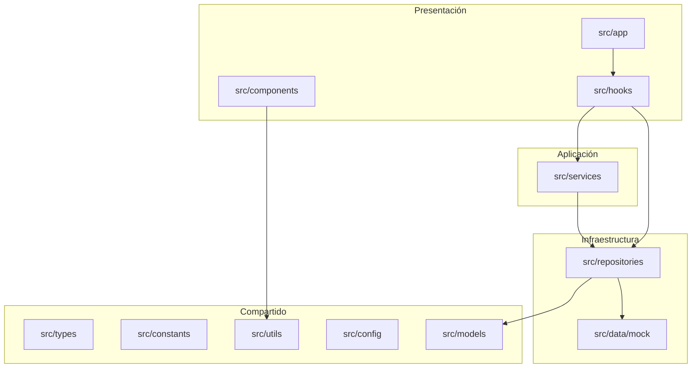

# Fase 3.4 — Refactorización y Preparación para Integraciones

**Proyecto:** HydroVision  
**Fecha:** Julio 2026  
**Estado:** Arquitectura optimizada · Sin cambios visuales · Sin conexiones externas

---

## 1. Objetivo

Optimizar la arquitectura antes de agregar nuevas funcionalidades, eliminando deuda técnica y preparando stubs documentados para GEE, IA, reportes y PostgreSQL.

---

## 2. Mejoras realizadas

### 2.1 Nueva estructura de capas

| Carpeta | Propósito |
|---------|-----------|
| `src/config/` | App, base de datos, estado de módulos |
| `src/utils/` | Fechas, `cn()`, helpers de repositorio |
| `src/repositories/` | Acceso a datos (movido desde `lib/repositories/`) |
| `src/services/` | GEE, IA, reportes — interfaces + mocks |
| `src/constants/filters.ts` | `ALL_STATIONS_VALUE` centralizado |
| `src/types/{gee,ai,reports}.ts` | Tipos por dominio |

### 2.2 Deuda técnica eliminada

| Problema | Solución |
|----------|----------|
| `resolveNombre()` duplicado en 2 repos | `@/utils/repository.utils` |
| Formateo de fechas duplicado | `@/utils/date.utils` |
| `FieldError` duplicado en 2 modales | `@/components/ui/FieldError` |
| 3 componentes KPI casi idénticos | `@/components/ui/KpiGrid` genérico |
| Constantes dispersas (`app.ts`, env) | `@/config/` centralizado |
| Barrel incompleto de repos | `@/repositories/index.ts` exporta todo |
| Stubs GEE/IA/PDF ad-hoc | `@/services/` con interfaces SOLID |
| `ALL_STATIONS_VALUE` en 2 lugares | `@/constants/filters.ts` |

### 2.3 Compatibilidad preservada

Re-exports en rutas legacy — **cero cambios de UX**:

```
@/lib/utils              → @/utils
@/lib/repositories/*     → @/repositories/*
@/lib/db/config          → @/config
@/lib/earth-engine/client → @/services/gee
@/lib/ai/client          → @/services/ai
@/lib/reports/pdf        → @/services/reports
```

---

## 3. Nueva arquitectura



---

## 4. Google Earth Engine (preparado)

Ubicación: `src/services/gee/`

| Archivo | Interface | Mock |
|---------|-----------|------|
| `earth-engine.service.ts` | `IEarthEngineService` | `MockEarthEngineService` |
| `satellite-image.repository.ts` | `ISatelliteImageRepository` | `MockSatelliteImageRepository` |
| `map-layer.manager.ts` | `IMapLayerManager` | `MockMapLayerManager` |
| `indices.calculator.ts` | `IIndicesCalculator` | `MockIndicesCalculator` |

**Activación Fase 4:** Implementar `GeeEarthEngineService` que reemplace el mock y conectar `services/earth-engine/` (Python).

---

## 5. Inteligencia Artificial (preparado)

Ubicación: `src/services/ai/`

| Archivo | Interface | Mock |
|---------|-----------|------|
| `risk-prediction.service.ts` | `IRiskPredictionService` | `MockRiskPredictionService` |
| `water-quality.analyzer.ts` | `IWaterQualityAnalyzer` | `MockWaterQualityAnalyzer` |
| `recommendation.engine.ts` | `IRecommendationEngine` | `MockRecommendationEngine` |

**Activación Fase 6:** Conectar FastAPI en `services/ai-service/`.

---

## 6. Reportes (preparado)

Ubicación: `src/services/reports/`

| Archivo | Interface | Mock |
|---------|-----------|------|
| `pdf.service.ts` | `IPDFService` | `MockPDFService` |
| `excel.service.ts` | `IExcelService` | `MockExcelService` |
| `statistics.service.ts` | `IStatisticsService` | `MockStatisticsService` |

---

## 7. PostgreSQL (preparado)

- Schema: `prisma/schema.prisma`
- Config: `src/config/database.config.ts`
- Cliente: `src/lib/db/prisma.client.ts`
- Repositorios: patrón listo para `if (isDatabaseConfigured())` en cada repo

---

## 8. Componentes refactorizados (sin cambio visual)

- `KpiCards`, `CampaignKpiCards`, `SampleKpiCards` → usan `KpiGrid`
- `CampaignFormModal`, `SampleFormModal` → usan `FieldError` compartido

---

## 9. Verificación

```powershell
cd C:\Users\ferch\Projects\hydrovision
npm run dev
```

Confirmar: Dashboard, Campañas, Muestreos funcionan igual visualmente.

---

## 10. Referencias

- Arquitectura actualizada: `docs/ARCHITECTURE.md`
- Fase anterior: `docs/FASE3_3.md`
- Servicios: `src/services/index.ts`
- Repositorios: `src/repositories/index.ts`
