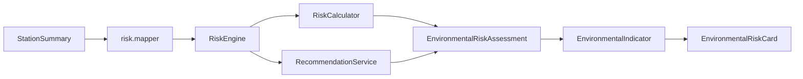

# Fase 4.0 — Motor Inteligente de Evaluación de Riesgo Ambiental

**Proyecto:** HydroVision  
**Fecha:** Julio 2026  
**Estado:** Motor operativo · Datos simulados · GEE/IA/PostgreSQL **no conectados**

---

## 1. Objetivo

Crear el primer motor de evaluación ambiental que analice automáticamente parámetros de calidad del agua, calcule un Índice General de Riesgo Ambiental (0–100) y genere explicaciones y recomendaciones — desacoplado de la UI.

---

## 2. Arquitectura

```
src/services/risk/
├── risk-thresholds.ts      # Umbrales por parámetro (extensible ECA)
├── risk-calculator.ts      # RiskCalculator — puntajes e índice
├── recommendation.service.ts # RecommendationService — textos automáticos
├── environmental-indicator.ts # EnvironmentalIndicator — DTO para UI
├── risk.mapper.ts          # StationSummary → EnvironmentalRiskInput
├── risk-engine.ts          # RiskEngine — orquestador
└── index.ts

src/hooks/useEnvironmentalRisk.ts   # Hook dashboard
src/components/dashboard/EnvironmentalRiskCard.tsx
src/types/risk.ts
```

### Flujo



### Principios SOLID

| Componente | Principio |
|------------|-----------|
| `RiskCalculator` | SRP — solo cálculo numérico |
| `RecommendationService` | SRP — solo recomendaciones y explicaciones |
| `EnvironmentalIndicatorBuilder` | SRP — transformación para UI |
| `RiskEngine` | Facade — orquestación sin lógica de presentación |
| Umbrales en `risk-thresholds.ts` | OCP — extensible sin modificar calculador |

---

## 3. Fórmula utilizada

### 3.1 Parámetros evaluados (7)

| Parámetro | Peso | Modo |
|-----------|------|------|
| pH | 15% | Rango óptimo 6.8–8.2 |
| Temperatura | 10% | Máximo (ideal ≤26 °C) |
| Oxígeno disuelto | 20% | Mínimo (ideal ≥6 mg/L) |
| Conductividad | 15% | Máximo |
| Turbidez | 15% | Máximo |
| Sólidos disueltos | 15% | Máximo |
| Caudal | 10% | Rango óptimo 1.5–8 m³/s |

### 3.2 Puntaje por parámetro (0–100)

Cada parámetro se evalúa contra tres zonas:

1. **Óptima** → puntaje 0–15 (Muy bajo / Bajo)
2. **Advertencia** → puntaje 15–45 (Moderado)
3. **Crítica** → puntaje 45–80 (Alto)
4. **Extrema** → puntaje 80–100 (Muy alto)

Interpolación lineal entre umbrales definidos en `risk-thresholds.ts`.

### 3.3 Índice General de Riesgo Ambiental

```
IGRA = Σ (puntaje_i × peso_i) / Σ peso_i
```

Resultado: escala **0–100**.

### 3.4 Clasificación general

| IGRA | Nivel | Color |
|------|-------|-------|
| 0–25 | 🟢 Riesgo Bajo | Verde |
| 26–50 | 🟡 Riesgo Moderado | Ámbar |
| 51–75 | 🟠 Riesgo Alto | Naranja |
| 76–100 | 🔴 Riesgo Muy Alto | Rojo |

### 3.5 Explicación automática

Se identifican los 3 parámetros con mayor puntaje (>30) y se genera texto en español:

> *"El riesgo aumenta debido a la baja concentración de oxígeno disuelto y al incremento de la turbidez."*

### 3.6 Recomendaciones

Generadas según nivel general + parámetros críticos:

- **Bajo:** monitoreo mensual rutinario
- **Moderado:** incrementar frecuencia quincenal
- **Alto:** inspección de fuentes contaminantes
- **Muy alto:** protocolo de alerta ambiental

---

## 4. Componentes UI

### `EnvironmentalRiskCard`

Nueva tarjeta en el Dashboard (debajo de KPIs):

- Indicador circular animado (SVG)
- Color dinámico según nivel
- Índice 0–100
- Descripción automática
- Lista de recomendaciones

**No modifica** KPIs, mapa, tabla ni panel lateral existentes.

### `useEnvironmentalRisk`

Hook que recibe `StationSummary[]` filtrados y retorna `assessment` + `indicator`. Sincronizado con filtros del mapa.

---

## 5. Evolución — Google Earth Engine (Fase 4+)

```typescript
// Futuro: extender RiskEngine.evaluate()
const satelliteBoost = indicesCalculator.calculateFromMock(stationIndex);
// Incorporar NDWI/NDTI como peso adicional en IGRA
```

- `risk-thresholds.ts` → añadir pesos satelitales
- `risk.mapper.ts` → incluir `SatelliteIndices`
- Sin cambiar `EnvironmentalRiskCard`

---

## 6. Evolución — Inteligencia Artificial (Fase 6)

```typescript
// Futuro: RiskEngine delegará a IRiskPredictionService
const aiScore = await riskPredictionService.predict(stationId, measurement, indices);
// Combinar: IGRA_final = α·IGRA_reglas + (1-α)·IA_score
```

- `RiskCalculator` permanece como baseline explicable (tesis)
- IA aporta score complementario no explicable

---

## 7. Evolución — ECA Perú

Reemplazar umbrales genéricos en `risk-thresholds.ts` por límites oficiales ECA:

```typescript
import { ECA_STANDARDS } from "@/lib/eca/standards";
// Sincronizar optimal/warning/critical desde ECA_STANDARDS
```

---

## 8. Verificación

```powershell
cd C:\Users\ferch\Projects\hydrovision
npm run dev
```

1. Abrir Dashboard (`/`)
2. Ver tarjeta **Riesgo Ambiental** bajo los KPIs
3. Filtrar estación individual — el índice se recalcula
4. Confirmar mapa, tabla y KPIs sin cambios

---

## 9. Referencias

- Motor: `src/services/risk/risk-engine.ts`
- Tipos: `src/types/risk.ts`
- ECA existente: `src/lib/eca/classifier.ts`
- Fase anterior: `docs/FASE3_4.md`
