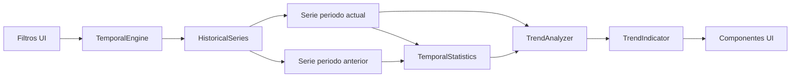

# Fase 4.1 — Sistema de Análisis Temporal de la Calidad del Agua

**Proyecto:** HydroVision  
**Fecha:** Julio 2026  
**Estado:** Módulo operativo · Datos simulados · GEE/IA/PostgreSQL **no conectados**

---

## 1. Objetivo

Crear un módulo profesional para visualizar la evolución temporal de parámetros fisicoquímicos, comparar periodos, calcular estadísticas descriptivas, clasificar tendencias y generar interpretaciones y recomendaciones automáticas — desacoplado de la interfaz.

---

## 2. Arquitectura

```
src/services/temporal/
├── temporal.constants.ts     # Metadatos de parámetros (unidad, varianza, dirección)
├── historical-series.ts        # HistoricalSeries — generación de series simuladas
├── temporal-statistics.ts      # TemporalStatistics — promedio, max, min, desv. std.
├── trend-analyzer.ts           # TrendAnalyzer — clasificación e interpretación
├── trend-indicator.ts          # TrendIndicator — DTO para UI
├── temporal-engine.ts          # TemporalEngine — orquestador
└── index.ts

src/repositories/temporal.repository.ts   # Estaciones disponibles (mock)
src/hooks/useTemporalAnalysis.ts          # Hook del módulo
src/components/temporal/                  # UI del módulo
src/types/temporal.ts                     # Tipos del dominio
src/app/analisis-temporal/page.tsx        # Ruta /analisis-temporal
```

### Flujo del análisis



### Principios SOLID

| Componente | Responsabilidad |
|------------|-----------------|
| `HistoricalSeries` | Generar y filtrar series históricas por estación/parámetro/rango |
| `TemporalStatistics` | Calcular estadísticas descriptivas |
| `TrendAnalyzer` | Regresión lineal, clasificación de tendencia, textos |
| `TrendIndicator` | Transformar resultados para presentación |
| `TemporalEngine` | Orquestación — Facade desacoplada de React |

---

## 3. Componentes

### Servicios (dominio)

#### HistoricalSeries
- Genera puntos semanales simulados determinísticos
- Base: parámetros actuales del mock store por estación
- Resuelve periodo anterior de igual duración

#### TemporalStatistics
- **Promedio:** media aritmética de la serie
- **Máximo / Mínimo:** extremos del periodo
- **Desviación estándar:** √(Σ(xᵢ − x̄)² / n) — simulada sobre datos generados

#### TrendAnalyzer
- Regresión lineal sobre puntos del periodo actual
- Clasificación según dirección del parámetro (`higherIsBetter`):
  - ↑ **Mejorando** — evolución favorable
  - → **Estable** — variación < 8% del rango
  - ↓ **Empeorando** — evolución desfavorable
- Genera interpretación en español y recomendaciones

#### TrendIndicator
- Expone indicador listo para UI (símbolo, color, texto)

### UI

| Componente | Función |
|------------|---------|
| `TemporalAnalysisView` | Vista principal del módulo |
| `TemporalFiltersBar` | Estación, parámetro, rango de fechas |
| `TemporalComparisonChart` | Gráfico de líneas (Recharts) — actual vs anterior |
| `TemporalStatisticsCards` | KPIs: promedio, max, min, desv. std. |
| `TrendIndicatorPanel` | Tendencia, interpretación, recomendaciones |
| `ExportChartButton` | Exportación simulada (toast informativo) |

### Parámetros disponibles

pH · Temperatura · Conductividad · Oxígeno Disuelto · Turbidez · Sólidos Totales Disueltos · Caudal

---

## 4. Comparación de periodos

| Periodo | Definición |
|---------|------------|
| **Actual** | Rango seleccionado por el usuario (default: mar–jun 2025) |
| **Anterior** | Mismo número de días inmediatamente antes del inicio |

El gráfico superpone ambas series: línea sólida (actual) y línea punteada (anterior).

---

## 5. Preparación — Google Earth Engine

```typescript
// Futuro: enriquecer HistoricalSeries con índices satelitales
const satelliteOverlay = await indicesCalculator.getTimeSeries(stationId, dateRange);
// Combinar parámetro in situ + NDTI/NDWI como capas adicionales en el gráfico
```

- `HistoricalSeries.build()` aceptará fuente `"field" | "satellite" | "combined"`
- Sin modificar `TemporalEngine` ni componentes UI

---

## 6. Preparación — Inteligencia Artificial

```typescript
// Futuro: TrendAnalyzer delegará detección avanzada a IA
const aiTrend = await waterQualityAnalyzer.detectAnomalies(series);
// Combinar: tendencia_reglas + alertas_IA
```

- `TrendAnalyzer` permanece como baseline explicable (regresión lineal)
- IA aportará detección de anomalías y predicción a futuro

---

## 7. Verificación

```powershell
cd C:\Users\ferch\Projects\hydrovision
npm run dev
```

1. Abrir **Análisis Temporal** en el sidebar (`/analisis-temporal`)
2. Seleccionar estación, parámetro y rango de fechas
3. Verificar gráfico comparativo, estadísticas y tendencia
4. Probar botón **Exportar gráfico** (toast simulado)
5. Confirmar que Dashboard y demás módulos no cambiaron

---

## 8. Referencias

- Motor temporal: `src/services/temporal/temporal-engine.ts`
- Tipos: `src/types/temporal.ts`
- Fase anterior: `docs/FASE4_0.md`
- Arquitectura general: `docs/ARCHITECTURE.md`
