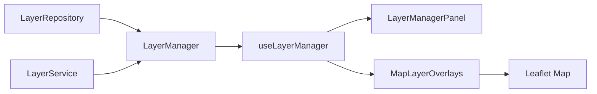

# Fase 4.3 — Gestor Profesional de Capas Geoespaciales (SIG)

**Proyecto:** HydroVision  
**Fecha:** Julio 2026  
**Estado:** Layer Manager operativo · Datos simulados · GEE **no conectado**

---

## 1. Objetivo

Crear el módulo geoespacial profesional **Layer Manager** para administrar capas del mapa con controles GIS estándar, sin modificar el Dashboard ni conectar Google Earth Engine.

---

## 2. Arquitectura

```
src/services/layers/
├── layer.repository.ts      # LayerRepository — catálogo y geometrías
├── layer.service.ts         # LayerService — visibilidad y opacidad
├── layer-manager.ts           # LayerManager — orquestador
├── layer-geometries.ts        # Geometrías simuladas
└── index.ts

src/types/layers.ts            # VectorLayer, RasterLayer, ManagedLayer
src/hooks/useLayerManager.ts
src/components/map/
├── GisMonitoringMap.tsx       # Mapa con capas GIS
├── GisMapView.tsx             # Vista de página
└── layers/
    ├── LayerManagerPanel.tsx  # Panel flotante GIS
    ├── MapLayerOverlays.tsx   # Renderizado Leaflet
    └── MapGisControls.tsx     # Cursor, minimapa
src/app/mapa/page.tsx
```

### Interfaces (Clean Architecture)

| Interfaz / Clase | Rol |
|------------------|-----|
| `LayerRepository` | Catálogo de capas + geometrías mock |
| `LayerService` | Estado: visible, opacidad, reset |
| `VectorLayer` | Polígonos y polilíneas administrativas/hidrográficas |
| `RasterLayer` | Índices satelitales simulados (NDWI, NDVI, MNDWI) |
| `LayerManager` | Facade — orquestación desacoplada de React |



---

## 3. Capas implementadas

| Capa | Tipo | Default |
|------|------|---------|
| Estaciones de monitoreo | marker | ✅ Visible |
| Ríos | vector (polyline) | ✅ Visible |
| Cuencas | vector (polygon) | ✅ Visible |
| Distritos | vector (polygon) | Oculto |
| Provincias | vector (polygon) | Oculto |
| Departamentos | vector (polygon) | Oculto |
| Índice NDWI | raster | Oculto |
| Índice NDVI | raster | Oculto |
| Índice MNDWI | raster | Oculto |
| Riesgo Ambiental | raster/círculos | Oculto |

### Controles por capa

- ✅ Activar / desactivar
- ✅ Opacidad (slider 0–100%)
- ✅ Leyenda automática
- ✅ Descripción contextual

---

## 4. Controles GIS

| Control | Implementación |
|---------|----------------|
| Panel flotante Layer Manager | Esquina superior izquierda |
| Lista de capas por categoría | Hidrografía, Administrativo, Satelital, Análisis |
| Barra de escala | Leaflet `ScaleControl` |
| Coordenadas del cursor | Lat/Lng en tiempo real |
| Minimapa | Vista de contexto con rectángulo de extensión |
| Restablecer vista | Recentra al río/filtro activo |

---

## 5. Dashboard preservado

El Dashboard (`/`) sigue usando `FilteredMonitoringMap` **sin cambios**.  
El Layer Manager completo está en **`/mapa`** (Mapa interactivo en sidebar).

---

## 6. Preparación — Google Earth Engine

```typescript
// Futuro: LayerManager.registerGeeRasterLayer()
layerManager.registerGeeRasterLayer("gee-ndwi-live", "NDWI GEE", "Índice desde Sentinel-2");

// LayerRepository obtendrá tiles desde EarthEngineService
// RasterLayer.source = "google_earth_engine"
```

- `RasterLayer` ya distingue `source: "mock" | "google_earth_engine"`
- `LayerManager.registerGeeRasterLayer()` preparado
- `MapLayerOverlays` renderizará `ImageOverlay` con URL GEE

---

## 7. Escalabilidad

- **Nuevas capas vectoriales:** agregar en `layer.repository.ts` + geometría en `layer-geometries.ts`
- **Nuevos índices:** extender `RasterLayer.indexKey`
- **Capas dinámicas GEE:** `registerGeeRasterLayer()` sin modificar UI
- **Z-index:** orden de renderizado controlado por `zIndex` en cada capa

---

## 8. Verificación

```powershell
cd C:\Users\ferch\Projects\hydrovision
npm run dev
```

1. Abrir **Mapa interactivo** (`/mapa`)
2. Panel **Layer Manager** — activar/desactivar capas
3. Ajustar transparencia y ver leyenda
4. Activar NDWI/NDVI/MNDWI — overlays simulados
5. Activar Riesgo Ambiental — círculos por estación
6. Verificar coordenadas, minimapa, escala y restablecer vista
7. Confirmar Dashboard (`/`) sin cambios

---

## 9. Referencias

- Motor: `src/services/layers/layer-manager.ts`
- Tipos: `src/types/layers.ts`
- GEE stub previo: `src/services/gee/map-layer.manager.ts`
- Fase anterior: `docs/FASE4_2.md`
