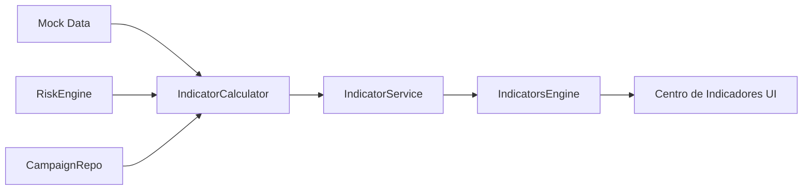

# Fase 4.4 — Motor Profesional de Indicadores Ambientales

**Proyecto:** HydroVision  
**Fecha:** Julio 2026  
**Estado:** Environmental Indicators Engine operativo · Datos simulados · GEE/PostgreSQL/IA **no conectados**

---

## 1. Objetivo

Crear el motor central que calcula, organiza y presenta todos los indicadores ambientales de la plataforma, con puntuación 0–100, clasificación automática y tarjetas reutilizables.

---

## 2. Arquitectura

```
src/services/indicators/
├── indicator.constants.ts     # Escala 0–100, colores, categorías
├── indicator.repository.ts      # IndicatorRepository — catálogo
├── indicator-calculator.ts      # IndicatorCalculator — cálculo
├── indicator.service.ts         # IndicatorService — filtro/orden/búsqueda
├── indicators-engine.ts         # IndicatorsEngine — orquestador
└── index.ts

src/types/indicators.ts          # Indicator, IndicatorCategory
src/hooks/useIndicatorsCenter.ts
src/components/indicators/
├── IndicatorCard.tsx            # Tarjeta reutilizable
├── IndicatorsCenter.tsx         # Toolbar + grid
└── IndicatorsCenterView.tsx     # Vista de página
src/app/indicadores/page.tsx
```

### Flujo



### Interfaces SOLID

| Componente | Responsabilidad |
|------------|-----------------|
| `IndicatorRepository` | Catálogo y metadatos de indicadores |
| `IndicatorCalculator` | Cálculo de valores y puntuaciones |
| `IndicatorService` | Filtrado, ordenamiento, agrupación |
| `IndicatorsEngine` | Facade desacoplado de React |

---

## 3. Indicadores implementados

| Categoría | Indicadores |
|-----------|-------------|
| **Calidad del Agua** | Índice de Calidad del Agua (IQAg) |
| **Cumplimiento ECA** | Tasa de Cumplimiento ECA |
| **Riesgo Ambiental** | Índice de Riesgo · Nivel General |
| **Tendencia Temporal** | Estabilidad Temporal |
| **Estado de Estaciones** | Operativas · En Alerta |
| **Estado de Campañas** | En Curso · Cobertura |
| **Calidad de Datos** | Integridad · Actualización |

### Campos por indicador

Nombre · Descripción · Valor · Unidad · Estado · Color · Icono · Importancia · Fecha de actualización · Tendencia · Barra de progreso · Semáforo

---

## 4. Sistema de puntuación (0–100)

| Rango | Clasificación |
|-------|---------------|
| 85–100 | Excelente |
| 70–84 | Bueno |
| 50–69 | Regular |
| 30–49 | Deficiente |
| 0–29 | Crítico |

Semáforo: 🟢 Verde · 🟡 Amarillo · 🟠 Naranja · 🔴 Rojo

---

## 5. Centro de Indicadores Ambientales

Ruta: `/indicadores`

Funcionalidades:
- **Buscar** por nombre o descripción
- **Filtrar** por categoría y estado
- **Ordenar** por puntuación, nombre, importancia o categoría
- **Agrupar** por categoría
- Tarjetas uniformes con mini-gráfico de tendencia

---

## 6. Escalabilidad

- Nuevo indicador: agregar en `indicator.repository.ts` + lógica en `indicator-calculator.ts`
- Nueva categoría: extender `IndicatorCategory` en `types/indicators.ts`
- `Indicator.source`: `"mock" | "postgresql" | "google_earth_engine" | "ai"`

---

## 7. Preparación — Google Earth Engine

```typescript
// Futuro: IndicatorCalculator incorporará índices GEE
const ndwiScore = await indicesCalculator.computeScore(stationId);
// source: "google_earth_engine"
```

---

## 8. Preparación — PostgreSQL

```typescript
// Futuro: IndicatorRepository leerá catálogo desde BD
const catalog = await indicatorRepo.findAllFromDatabase();
// source: "postgresql"
```

---

## 9. Preparación — Inteligencia Artificial

```typescript
// Futuro: puntuaciones complementarias desde IA
const aiScore = await waterQualityAnalyzer.predictIndicator(indicatorId);
// Combinar: score_final = α·reglas + (1-α)·IA
```

---

## 10. Compatibilidad

- Dashboard y módulos existentes **sin modificaciones**
- Reutiliza `RiskEngine`, `getCampaignStats`, mock store
- No rompe `EnvironmentalIndicator` del módulo de riesgo (Fase 4.0)

---

## 11. Verificación

```powershell
cd C:\Users\ferch\Projects\hydrovision
npm run dev
```

1. Abrir **Indicadores** en sidebar (`/indicadores`)
2. Verificar 11 tarjetas con diseño uniforme
3. Probar búsqueda, filtros, ordenamiento y agrupación
4. Confirmar semáforos, barras de progreso y mini-tendencias
5. Dashboard (`/`) sin cambios

---

## 12. Referencias

- Motor: `src/services/indicators/indicators-engine.ts`
- Tipos: `src/types/indicators.ts`
- Fase anterior: `docs/FASE4_3.md`
