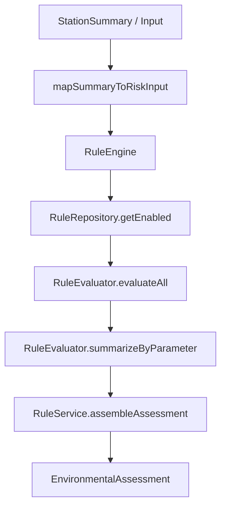

# Fase 4.5 — Environmental Rules Engine

**Proyecto:** HydroVision  
**Fecha:** Julio 2026  
**Estado:** Motor de reglas operativo · Datos simulados · PostgreSQL/GEE/IA **no conectados**

---

## 1. Objetivo

Diseñar e implementar el núcleo lógico de HydroVision mediante un **motor de reglas ambientales** desacoplado de la interfaz, capaz de interpretar automáticamente parámetros fisicoquímicos y generar observaciones y recomendaciones para apoyo a la decisión (DSS).

---

## 2. Arquitectura

```
src/services/rules/
├── rule.definitions.ts      # Catálogo mock de reglas (21 reglas, 7 parámetros)
├── rule.repository.ts       # RuleRepository — acceso configurable
├── rule-evaluator.ts        # RuleEvaluator — evaluación lógica
├── rule.service.ts          # RuleService — observaciones y recomendaciones
├── rule-engine.ts           # RuleEngine — orquestador
└── index.ts

src/types/rules.ts           # Rule, RuleResult, EnvironmentalAssessment
src/hooks/useEnvironmentalRules.ts
```

### Flujo de evaluación



### Principios SOLID

| Componente | Responsabilidad |
|------------|-----------------|
| `RuleRepository` | Persistencia y catálogo de reglas (mock → PostgreSQL) |
| `RuleEvaluator` | Evaluación pura sin efectos secundarios |
| `RuleService` | Generación de textos y recomendaciones |
| `RuleEngine` | Facade — orquestación desacoplada de React |

---

## 3. Motor de reglas

### Parámetros evaluados (7)

pH · Oxígeno Disuelto · Conductividad · Temperatura · Turbidez · Sólidos Totales Disueltos · Caudal

### Estructura de cada regla

| Campo | Descripción |
|-------|-------------|
| `name` | Nombre de la regla |
| `description` | Descripción técnica |
| `parameter` | Parámetro evaluado |
| `operator` | `between`, `gte`, `lte` |
| `expectedMin/Max/Value` | Valor esperado |
| `severityOnFail` | Severidad si no cumple |
| `suggestedAction` | Acción sugerida |

### Clasificación de severidad

| Nivel | Etiqueta |
|-------|----------|
| `normal` | Normal |
| `atencion` | Atención |
| `alerta` | Alerta |
| `critico` | Crítico |

Cada parámetro tiene **3 reglas escalonadas** (atención → alerta → crítico). Se aplica la **peor severidad** incumplida.

### EnvironmentalAssessment — salida

- **Estado General** — peor severidad entre parámetros
- **Parámetros fuera de rango** — lista de claves y etiquetas
- **Nivel de Riesgo** — mapeo a Risk Engine (`bajo` → `muy_alto`)
- **Cantidad de alertas** — parámetros con severidad ≠ normal
- **Observación técnica** — texto automático en español
- **Recomendaciones** — acciones priorizadas

---

## 4. Ejemplo de observación

> *"La turbidez supera el rango recomendado mientras que el oxígeno disuelto presenta valores inferiores al esperado."*

---

## 5. Recomendaciones automáticas

| Severidad | Ejemplos |
|-----------|----------|
| Normal | Continuar monitoreo |
| Atención | Incrementar frecuencia de monitoreo |
| Alerta | Inspeccionar descargas · Nueva campaña |
| Crítico | Protocolo de alerta · Campaña urgente |

---

## 6. Refactorización aplicada

- **Reutilización DRY:** `RuleEngine` usa `mapSummaryToRiskInput` del Risk Engine (Fase 4.0) — una sola fuente de mapeo de parámetros.
- **Coexistencia:** El clasificador ECA (`lib/eca/classifier.ts`) se mantiene intacto para no alterar la UI existente.
- **Hook preparado:** `useEnvironmentalRules` disponible para integración futura sin cambios visuales.

---

## 7. Preparación — ECA Perú

```typescript
// Futuro: RuleRepository.loadFromDatabase()
await ruleRepository.loadFromDatabase(await prisma.environmentalRule.findMany());
// normativeRef: "ECA Agua — Cuerpos receptores — D.S. xxx"
```

Las reglas mock incluyen `normativeRef` orientativa alineada con ECA.

---

## 8. Preparación — PostgreSQL

```typescript
// Modelo Prisma futuro
model EnvironmentalRule {
  id              String
  parameter       String
  operator        String
  expectedMin     Float?
  expectedMax     Float?
  severityOnFail  String
  suggestedAction String
  enabled         Boolean
}
```

`RuleRepository.loadFromDatabase()` ya implementado.

---

## 9. Preparación — Inteligencia Artificial

```typescript
// Futuro: reglas complementarias generadas por IA
const aiRules = await recommendationEngine.inferRules(historicalData);
// Combinar: evaluación_reglas + score_IA
```

El motor basado en reglas permanece **explicable** para la tesis.

---

## 10. Preparación — Google Earth Engine

```typescript
// Futuro: reglas sobre índices satelitales
rules.push({
  parameter: "ndwi",
  operator: "gte",
  expectedValue: 0.1,
  severityOnFail: "alerta",
});
```

Extender `RuleParameterKey` sin modificar `RuleEvaluator`.

---

## 11. Uso programático

```typescript
import { ruleEngine } from "@/services/rules";

const assessment = ruleEngine.evaluateStation(stationSummary);
console.log(assessment.observation);
console.log(assessment.recommendations);
```

```typescript
import { useEnvironmentalRules } from "@/hooks/useEnvironmentalRules";
// Hook listo — sin cambios visuales en Fase 4.5
```

---

## 12. Compatibilidad

- Dashboard, mapa, indicadores y demás módulos **sin modificaciones visuales**
- 21 reglas mock en `rule.definitions.ts`
- Sin APIs externas ni IA conectadas

---

## 13. Verificación

```powershell
cd C:\Users\ferch\Projects\hydrovision
npm run dev
```

1. Confirmar compilación sin errores
2. Importar `ruleEngine` en consola o test manual
3. Verificar que Dashboard y módulos existentes operan igual

---

## 14. Referencias

- Motor: `src/services/rules/rule-engine.ts`
- Tipos: `src/types/rules.ts`
- ECA legacy: `src/lib/eca/classifier.ts`
- Risk Engine: `docs/FASE4_0.md`
- Fase anterior: `docs/FASE4_4.md`
