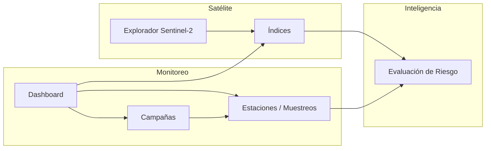

# HydroVision — Arquitectura Modular

**Sprint 2B** · Plataforma modular preparada para crecimiento futuro.

---

## 1. Visión general

HydroVision evoluciona de una aplicación monolítica de un solo propósito a una **plataforma modular**. Cada módulo tiene responsabilidades acotadas, rutas propias y servicios asociados. Los módulos se comunican a través de contratos (interfaces TypeScript) y datos compartidos en la capa de providers, sin acoplamiento directo entre UI de distintos dominios.

```
┌─────────────────────────────────────────────────────────────┐
│                    HydroVision Platform                      │
├──────────┬──────────┬──────────┬──────────┬─────────────────┤
│   Core   │ Monitoreo│ Tecnol.  │ Satélite │ Inteligencia    │
│          │ Ambiental│ Ambiental│          │ Ambiental       │
├──────────┴──────────┴──────────┴──────────┴─────────────────┤
│              Providers · Mock Store · Prisma Schema          │
└─────────────────────────────────────────────────────────────┘
```

**Ubicación en código:** `src/platform/modules/`

| Archivo | Rol |
|---------|-----|
| `types.ts` | Tipos de módulo y navegación |
| `registry.ts` | Definición y metadatos de cada módulo |
| `navigation.ts` | Menú lateral jerárquico |
| `index.ts` | API pública del paquete |

---

## 2. Responsabilidad de cada módulo

### Core (`core`)

- Layout, sidebar modular, configuración global.
- Punto de entrada: `/` (Inicio).
- No contiene lógica de dominio científico.

### Monitoreo Ambiental (`environmental-monitoring`)

- Dashboard operativo, estaciones, campañas, evaluación ECA, índices satelitales en contexto de monitoreo.
- Rutas: `/`, `/estaciones`, `/campanas`, `/muestreos`, `/indicadores`, `/analisis-temporal`, `/centro-geoespacial`, `/mapa`, `/satelite`.
- Servicios: `risk`, `indicators`, `temporal`, `layers`, `gis`, `satellite-index-engine`.

#### Submódulo: Estaciones de Monitoreo (Sprint 2C)

Primer módulo funcional completo bajo Monitoreo Ambiental.

| Capa | Ubicación |
|------|-----------|
| Mock data | `src/lib/mock/stations.ts`, `campaigns.ts`, `measurements.ts` |
| Repositorio | `src/repositories/station.repository.ts` |
| Tipos UI | `src/types/station-management.ts` |
| Páginas | `/estaciones`, `/estaciones/[id]` |
| Componentes | `src/components/stations/*` |

**Funcionalidades:**
- Tabla profesional con 12 columnas (código, nombre, río, cuenca, departamento, coordenadas, altitud, estado, última campaña, ECA).
- Buscador y filtros por cuenca, río, estado y clasificación ECA.
- Vista tabla / tarjetas con toggle.
- Página de detalle: información general, mapa placeholder, historial de campañas, parámetros, gráficos históricos, clasificación ECA e índices satelitales simulados.

**Flujo de datos:** `mock/store.ts` → `lib/mock/*` → `station.repository` → páginas/componentes. Sin PostgreSQL ni GEE.

**Navegación:** *Estaciones* → `/estaciones`; *Muestreos* → `/muestreos` (registro de muestras, preservado).

#### Submódulo: Campañas de Monitoreo (Sprint 2D)

Gestión profesional de campañas ambientales bajo Monitoreo Ambiental.

| Capa | Ubicación |
|------|-----------|
| Mock data | `src/lib/mock/campaigns.ts` |
| Repositorio | `src/repositories/campaign.repository.ts` |
| Tipos UI | `src/types/campaign.ts` |
| Páginas | `/campanas`, `/campanas/[id]` |
| Componentes | `CampaignTable`, `CampaignCard`, `CampaignFilters`, `CampaignForm`, `CampaignDetail` |

**Funcionalidades:**
- Tabla profesional: código, nombre, fecha, responsable, estaciones, parámetros, estado, observaciones.
- Filtros por año, mes, responsable y estado; buscador integrado.
- Toggle vista tabla / tarjetas.
- Formulario *Nueva Campaña* simulado (nombre, fecha, responsable, objetivo, descripción, estaciones, observaciones).
- Detalle: información general, estaciones, parámetros agregados, gráficos de muestras y ECA, resumen de cumplimiento.

**Flujo de datos:** `mock/store.ts` → `lib/mock/campaigns.ts` → `campaign.repository` → UI. Metadatos extendidos en memoria para campañas creadas desde el formulario.

#### Submódulo: Parámetros de Calidad del Agua (Sprint 2E)

Módulo central de evaluación fisicoquímica y microbiológica.

| Capa | Ubicación |
|------|-----------|
| Catálogo | `src/lib/parameters/catalog.ts` |
| Clasificador | `src/lib/eca/parameter-classifier.ts` |
| Mock data | `src/lib/mock/parameters.ts` |
| Repositorio | `src/repositories/parameter.repository.ts` |
| Tipos UI | `src/types/parameter-management.ts` |
| Páginas | `/parametros`, `/parametros/[codigo]` |
| Componentes | `ParameterTable`, `ParameterCard`, `ParameterChart`, `ParameterDetail`, `ParameterFilters`, `ParameterSummary` |

**Categorías:** físicas (temperatura, turbidez, conductividad), químicas (pH, OD, DBO5, DQO, nitratos, fosfatos), microbiológicas (coliformes totales, termotolerantes, E. coli).

**Funcionalidades:**
- Tabla profesional con 10 columnas y clasificación ECA automática.
- KPIs: total, cumplen, en alerta, no cumplen.
- Gráficos Recharts: barras, radar, líneas, comparación entre campañas.
- Filtros por estación, campaña, categoría, estado y fecha; buscador inteligente.
- Detalle por parámetro: descripción científica, método, histórico, gráfico temporal, interpretación ECA.

**Navegación:** *Parámetros* → `/parametros` (activo desde Sprint 2E).

#### Submódulo: Reportes Ambientales (Sprint 2F)

Generación de informes científicos con vista previa interactiva.

| Capa | Ubicación |
|------|-----------|
| Mock data | `src/lib/mock/reports.ts` |
| Repositorio | `src/repositories/report.repository.ts` |
| Tipos UI | `src/types/report-management.ts` |
| Página | `/reportes` |
| Componentes | `ReportTable`, `ReportViewer`, `ReportFilters`, `ReportSummary`, `ReportCharts` |

**Pestañas:** Resumen Ejecutivo, Calidad del Agua, Campañas, Estaciones, Índices Satelitales, Riesgo Ambiental.

**Funcionalidades:**
- Vista previa con título, fecha, responsable, resumen, tablas, gráficos Recharts y conclusiones.
- Filtros por cuenca, río, estación, campaña y rango de fechas.
- Botones Exportar PDF / Excel (interfaz preparada) e Imprimir (`window.print`).

**Navegación:** *Reportes* → `/reportes` (activo desde Sprint 2F).

#### Submódulo: Centro de Evaluación Ambiental (Sprint 2G)

Panel ejecutivo de apoyo a la decisión — estado integral por estación/campaña.

| Capa | Ubicación |
|------|-----------|
| Motor diagnóstico | `src/lib/evaluation/diagnosis-engine.ts` |
| Mock data | `src/lib/mock/environmental-evaluation.ts` |
| Repositorio | `src/repositories/environmental-evaluation.repository.ts` |
| Tipos UI | `src/types/environmental-evaluation.ts` |
| Página | `/evaluacion-ambiental` |
| Componentes | `EnvironmentalSummary`, `EnvironmentalIndicators`, `EnvironmentalDiagnosis`, `EnvironmentalRecommendations`, `EnvironmentalCharts`, `EnvironmentalStatusCard` |

**Secciones:** Estado general (semáforo, riesgo), indicadores, resumen estación, parámetros críticos, tendencias temporales (pH, OD, turbidez, conductividad), evaluación automática y recomendaciones.

**Preservado:** `/indicadores` — Centro de Indicadores (Environmental Indicators Engine).

**Navegación:** *Evaluación Ambiental* → `/evaluacion-ambiental`; *Centro de Indicadores* → `/indicadores`.

#### Submódulo: Centro Geoespacial (Sprint 2H)

Vista unificada sobre mapa Leaflet con capas simuladas preparadas para Google Earth Engine.

| Capa | Ubicación |
|------|-----------|
| Layer provider (contrato) | `src/lib/geospatial/layer-provider.interface.ts` |
| Mock provider | `src/lib/geospatial/mock-layer-provider.ts` |
| Mock data | `src/lib/mock/geospatial.ts` |
| Repositorio | `src/repositories/geospatial.repository.ts` |
| Tipos UI | `src/types/geospatial-center.ts` |
| Hook | `src/hooks/useGeospatialCenter.ts` |
| Página | `/centro-geoespacial` |
| Componentes | `GeoMap`, `GeoSidebar`, `GeoFilters`, `GeoLegend`, `StationPopup`, `LayerControl` |

**Funcionalidades:** marcadores por estado ambiental (🟢 Buena, 🟡 Alerta, 🔴 Crítica, ⚪ Sin información), panel lateral de estación, control de capas (Estaciones, Ríos, Cuencas, Riesgo Ambiental, Índices Satelitales), filtros por departamento/cuenca/río/estado y buscador de estaciones.

**Preservado:** `/mapa` — Mapa Interactivo legacy (GisMapView).

**Arquitectura GEE:** `IGeospatialLayerProvider` permite reemplazar `MockGeospatialLayerProvider` por un proveedor GEE sin modificar componentes UI.

**Navegación:** *Centro Geoespacial* → `/centro-geoespacial`; *Mapa Interactivo* → `/mapa`.

### Tecnologías Ambientales (`environmental-technologies`)

- BioBalsa inteligente, captación de neblina, humedales artificiales, restauración ecosistémica.
- **Estado:** planificado. BioBalsa marcado como *En desarrollo*; el resto *Próximamente*.

### Observación Satelital (`satellite-observation`)

- Explorador Sentinel-2, catálogo Landsat, imágenes e índices espectrales.
- Rutas activas: `/satelite`, `/indicadores` (índices).
- Servicios: `satellite-explorer`, `google-earth-engine`, `satellite-index-engine`.

### Inteligencia Ambiental (`environmental-intelligence`)

- Evaluación de riesgo, predicción y alertas.
- Ruta activa: `/indicadores` (riesgo e indicadores ejecutivos).
- Servicios: `ai`, `risk`, `executive`.

### Administración (`administration`)

- Estado del sistema, usuarios y permisos.
- Ruta activa: `/admin/system-status`.
- Servicios: diagnóstico GEE (simulado).

---

## 3. Flujo entre módulos



1. **Monitoreo → Satélite:** el Dashboard consume índices del *Satellite Index Engine*; el explorador en `/satelite` alimenta la misma capa de índices (mock).
2. **Monitoreo → Inteligencia:** mediciones de campo y cumplimiento ECA alimentan el servicio de riesgo (`services/risk`).
3. **Satélite → Inteligencia:** índices NDVI/NDWI/MNDWI/NDTI entran en evaluaciones de riesgo e indicadores ejecutivos.
4. **Administración:** expone salud de GEE y credenciales sin acoplar la UI de monitoreo.

Los módulos **no importan componentes UI** de otros módulos; comparten solo servicios, tipos y providers.

---

## 4. Módulos implementados

| Módulo | Versión | Rutas activas | Notas |
|--------|---------|---------------|-------|
| Core | 2.0.0 | `/` | Navegación modular Sprint 2B |
| Monitoreo Ambiental | 1.6.0 | 13 rutas | **Centro Geoespacial** 2H · Evaluación 2G · Reportes 2F |
| Observación Satelital | 0.5.0 | `/satelite`, `/indicadores` | GEE simulado |
| Inteligencia Ambiental | 0.3.0 | `/indicadores` | Riesgo mock |
| Administración | 0.2.0 | `/admin/system-status` | Auth GEE simulado |

---

## 5. Módulos futuros

| Módulo / ítem | Estado en UI | Sprint sugerido |
|---------------|--------------|-----------------|
| Parámetros (catálogo ECA UI) | Implementado | 2E ✓ |
| Reportes PDF | Implementado (vista previa) | 2F ✓ |
| BioBalsa Inteligente | En desarrollo | 3 |
| Captación de Neblina | Próximamente | 4+ |
| Humedales Artificiales | Próximamente | 4+ |
| Restauración de Ecosistemas | Próximamente | 4+ |
| Landsat (explorador dedicado) | Próximamente | 5 |
| Imágenes (catálogo) | Próximamente | 5 |
| Predicción IA | Próximamente | 6 |
| Alertas | Próximamente | 6 |
| Usuarios / RBAC | Próximamente | 3 |

---

## 6. Navegación lateral (Sprint 2B)

```
🏠 Inicio
🌊 Monitoreo Ambiental
   ├── Dashboard
   ├── Estaciones → /estaciones
   ├── Muestreos → /muestreos
   ├── Campañas
   ├── Parámetros → /parametros
   ├── Evaluación Ambiental → /evaluacion-ambiental
   ├── Centro de Indicadores → /indicadores
   ├── Índices Satelitales
   ├── Reportes → /reportes
   ├── Análisis Temporal *
   ├── Centro Geoespacial → /centro-geoespacial
   └── Mapa Interactivo *
🧪 Tecnologías Ambientales
   ├── BioBalsa Inteligente (En desarrollo)
   ├── Captación de Agua de Neblina (Próximamente)
   ├── Humedales Artificiales (Próximamente)
   └── Restauración de Ecosistemas (Próximamente)
🛰️ Observación Satelital
   ├── Sentinel-2
   ├── Landsat (Próximamente)
   ├── Imágenes (Próximamente)
   └── Índices
🤖 Inteligencia Ambiental
   ├── Evaluación de Riesgo
   ├── Predicción (Próximamente)
   └── Alertas (Próximamente)
⚙ Administración
   ├── Estado del Sistema
   └── Usuarios (Próximamente)
```

\* Ítems preservados para no perder rutas existentes fuera del menú original del sprint.

---

## 7. Reglas de evolución

1. **Un módulo = un dominio:** nuevas pantallas viven bajo el módulo correspondiente en `registry.ts` y `navigation.ts`.
2. **Sin lógica en el menú:** `navigation.ts` solo declara rutas y estados; la lógica permanece en `src/services/` y `src/app/`.
3. **Feature flags:** ítems con `status: "coming_soon" | "in_development"` no tienen `href` y no renderizan enlaces.
4. **Compatibilidad:** las URLs existentes siguen funcionando aunque cambie la agrupación visual del sidebar.

---

## 8. Referencias

- `src/platform/modules/registry.ts` — registro canónico de módulos
- `src/platform/modules/navigation.ts` — menú lateral
- `src/components/layout/Sidebar.tsx` — renderizado UI
- `src/repositories/station.repository.ts` — gestión de estaciones (Sprint 2C)
- `src/lib/mock/environmental-evaluation.ts` — evaluación ambiental (Sprint 2G)
- `src/lib/mock/geospatial.ts` — centro geoespacial (Sprint 2H)
- `src/lib/geospatial/` — layer provider mock/GEE (Sprint 2H)
- `src/lib/mock/reports.ts` — mock de reportes (Sprint 2F)
- `src/lib/mock/parameters.ts` — mock de parámetros (Sprint 2E)
- `src/lib/mock/campaigns.ts` — mock de campañas (Sprint 2D)
- `src/lib/mock/stations.ts` — mock de estaciones (Sprint 2C)
- `docs/TECHNICAL_AUDIT_V1.md` — deuda técnica y prioridades P0
